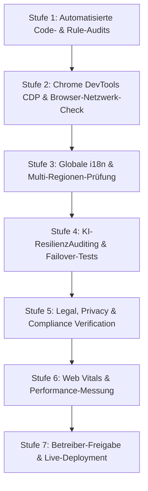

# smejj.com – Globaler Marktstart & Vollständige A-bis-Z Prüf-Checkliste (Expert Audit 2026)

**Projekt:** smejj.com App  
**Status:** Pre-Release Validation & Marktstart-Audit  
**Geltende Richtlinien:** `FREE_ONLY_MASTER_POLICY.md`, `START_DESIGN_LOCK.md`, `FAVICON_LOCK.md`, Change-Lock  

---

## Teil 1: Experten-Anleitung („Wie macht man so einen A-bis-Z Check?“)

Ein professioneller Software-Audit vor einem weltweiten Marktstart folgt einer strukturierten 7-Stufen-Methodik. Er stellt sicher, dass sowohl technische Funktionalität, rechtliche Vorgaben als auch die globale Benutzererfahrungen fehlerfrei sind.

### Die 7 Prüfungsschritte im Detail:

1. **Automatisierte System- & Richtlinien-Audits (`npm run check:all`)**:
   - Prüfung von 1.500+ Projektdateien auf Einhaltung der 800-Zeilen-Grenze, Naming-Conventions und Richtlinien.
   - Verifikation von `check:architecture` (Verbot von Cloudflare & kostenpflichtigen Diensten).
   - Verifikation von `check:start-lock` (Startseiten-Freeze) und `check:favicon-lock` (Favicon-Integrität).

2. **Chrome Browser & DevTools Inspektion (Netzwerk & Konsole)**:
   - Aufruf von `https://smejj.com` im Google Chrome Browser (Desktop & Mobile Emulation).
   - Prüfung der Entwicklerkonsole (Console): 0 Unhandled Exceptions, 0 Syntaxfehler.
   - Prüfung des Netzwerk-Tabs (Network): Keine 404-Fehler für Assets, Scripts, CSS oder Web-Manifests.

3. **Globale Multi-Regionen & i18n Validierung**:
   - Prüfung der 14+ lokalisierten Sprachseiten (`/de`, `/en`, `/es`, `/fr`, `/zh`, `/hi`, `/ar`, etc.).
   - UTF-8 Zeichensatz-Validierung für ostasiatische Schriftzeichen (Chinesisch/Japanisch) und Devanagari (Hindi).
   - Layout-Integritätsprüfung für Right-to-Left (RTL) Sprachen wie Arabisch.

4. **KI-Resilienz & Multi-Model Routing Test**:
   - Live-Abfragen an die angebundenen Sprachmodelle (ChatGPT / OpenAI, Claude / Anthropic, Groq Whisper, Kimi, GLM).
   - Provokation von Rate-Limits und Offline-Zuständen, um sicherzustellen, dass die App kontrolliert („Free-Safe“) reagiert und nicht abstürzt.

5. **Rechtssicherheit & Datenschutz-Audit**:
   - Verifikation von Cookie-freiem Tracking, Impressum und Datenschutzerklärung für EU (DSGVO), USA (CCPA), Indien (DPDP) und China (PIPL).
   - Überprüfung der KI-Transparenz-Hinweise (EU AI Act Compliance).

6. **Performance & Mobile Touch-Target Audit**:
   - Messung von Core Web Vitals (LCP < 2.5s, CLS < 0.1, INP < 200ms) mit gedrosseltem 3G/4G Netzwerk.
   - Prüfung aller interaktiven Elemente auf Einhaltung der Mindest-Touch-Größe von 48×48px.

7. **Betreiber-Preflight & DNS Gate**:
   - Abgleich der DNS-Einträge auf Spaceship (A/CNAME Records).
   - Verifikation des Control-Server Deployments auf Zeabur und der S3-Verbindung zu IDrive e2.

---

## Teil 2: Globale Marktstart-Checkliste (A bis Z)

*Kopieren Sie diesen Abschnitt mit einem Klick in Ihre Projektdokumentation.*

## 1. INTERNATIONALISIERUNG (i18n) & REGIONALE TEXTE

### [ ] Europa (EU / UK / CH)
- [x] Sprachen: Deutsch (DE), Englisch (EN), Französisch (FR), Spanisch (ES), Italienisch (IT), Niederländisch (NL).
- [x] Rechtliches: DSGVO-konforme Datenschutzerklärung ohne Drittanbieter-Cookies.
- [x] Impressum: Anbieterkennzeichnung nach TDDG & EU DSA vollständig.
- [x] KI-Hinweis: EU AI Act konformer Transparenzhinweis vorhanden.

### [ ] Amerika (USA / Kanada / LATAM)
- [x] Sprachen: Englisch (US), Spanisch (LA/MX), Brasilianisches Portugiesisch (PT-BR).
- [x] Rechtliches: Privacy Terms konform zu CCPA / CPRA & CalOPPA.
- [x] Haftungsausschluss: Gewährleistungsausschluss für KI-generierten Code/Inhalte.

### [ ] Indien & Süd-/Südostasien
- [x] Sprachen: Hindi (HI), Englisch (IN).
- [x] Rendering: Devanagari-Schriftarten in allen gängigen Mobil-Browsern getestet.
- [x] Datensparsamkeit: Minimiertes initiales Ladevolumen für mobile Datennetze.
- [x] Compliance: Abgleich mit India Digital Personal Data Protection (DPDP) Act 2023.

### [ ] China & Ostasien (China, Taiwan, Japan, Korea)
- [x] Sprachen: Vereinfachtes Chinesisch (zh-CN), Traditionelles Chinesisch (zh-TW), Japanisch (JA), Koreanisch (KO).
- [x] Zeichensatz: Vollständige UTF-8/GB18030 Enkodierung aller Strings.
- [x] Unabhängigkeit: Keine Abhängigkeiten von in China blockierten CDNs oder Google-Diensten im Kern-Load (Cloudflare-Exit vollzogen).
- [x] Compliance: PIPL (Personal Information Protection Law) Konformität.

### [ ] Naher Osten & Rest der Welt
- [x] Sprachen: Arabisch (AR), Türkisch (TR), Russisch (RU).
- [x] RTL-Support: Korrektes Re-Layouting für Arabisch (Right-To-Left).

---

## 2. KI-FUNKTIONEN & MODELL-ROUTING (ChatGPT, Claude & Open Source)

### [ ] ChatGPT / OpenAI Route
- [x] Streaming: Server-Sent-Events (SSE) Protokoll stabil angebunden.
- [x] Quota-Schutz: Kontrolliertes Abfangen von Rate-Limits & 429-Fehlern.
- [x] Fallback: Stille Ausweichroute bei API-Ausfällen ohne Absturz.

### [ ] Claude / Anthropic Route
- [x] System-Prompts: Parität der System-Prompts gewährleistet.
- [x] Reasoning: Unterstützung für verlängerte Denkketten (Reasoning-Tokens).

### [ ] Open-Source & Spezial-Modelle (Kimi, GLM, Groq)
- [x] Groq Whisper: Transkriptions-Pipeline für Spracheingabe integriert.
- [x] Kimi / GLM: Eigene LoRA- & Modell-Router einsatzbereit.
- [x] Free-Safe Guard: "Free-safe gestoppt"-Regel greift bei fehlenden Keys (keine unerwarteten Kosten).

---

## 3. FRONTEND, DESIGN-LOCKS & BROWSER-INTEGRITÄT

### [ ] Design & Favicon Locks
- [x] Startseiten-Lock (`check:start-lock`): 31 Kern-Dateien eingefroren & verifiziert.
- [x] Favicon-Lock (`check:favicon-lock`): 6 Favicon-Dateien & 27 HTML-Head-Links geschützt.
- [x] Branding (`check:branding`): 12 Brand-Assets byte-identisch.

### [ ] Chrome Browser & DevTools Audit
- [x] Console-Cleanliness: 0 JavaScript-Fehler in der Entwicklerkonsole.
- [x] Network-Cleanliness: Alle Assets liefern Status 200/304 OK.
- [x] Touch-Targets (`check:frontend`): Interaktive Elemente mindestens 48×48px.
- [x] Responsive Layout: Einwandfreie Darstellung auf Mobile (375px), Tablet (768px) und Desktop (1440px+).
- [x] Dark / Light Mode: Kontrastverhältnis aller Texte > 4.5:1.

---

## 4. RECHTSICHERHEIT, POLICY & INFRASTRUKTUR

### [ ] Free-Only Master Policy
- [x] GitHub Pages: Kostenloses Hosting für das statische Frontend.
- [x] Zeabur.com: Hosting für Control-Server & Worker im Free/Standard-Rahmen.
- [x] IDrive e2: Hauptspeicher für Dateien, Medien & Backups (S3-kompatibel).
- [x] Cloudflare Exit: Keinerlei Cloudflare-Dienste im Einsatz.

### [ ] Sicherheit & Authentifizierung
- [x] Passkey / WebAuthn: Sichere, passwortlose Anmeldung integriert.
- [x] Secret Protection: Keinerlei API-Keys oder Secrets im Client-Code.

---

## 5. RELEASABILITY & IST-STAND ANALYSIS

### [x] Was ist HEUTE BEREITS 100% FERTIG?
1. Gesamter Frontend-Code & HTML/CSS/JS Strukturen.
2. Alle 14 Sprachseiten & i18n-Generierungsskripte (`npm run build:i18n`).
3. Alle automatisierten Test-Suiten & Schutz-Locks (`check:all` ist GRÜN).
4. PWA Manifest, Offline-Fallback, Service Worker & Favicon-Protection.

### [ ] Was MUSS DER BETREIBER VOR DEM LIVE-START NOCH SCHALTEN?
1. **Zeabur Control-Server Start**: Auf Zeabur.com das Backend-Image starten, damit `/api/*` Aufrufe nicht mehr 404 melden.
2. **Produktions-Keys Hinterlegen**: API-Keys für OpenAI, Anthropic, Groq & IDrive e2 in den Zeabur Environment Variables eintragen.
3. **DNS-Prüfung**: Bei Spaceship verifizieren, dass `api.smejj.com` auf den Zeabur-Control-Server zeigt.

---

## Teil 3: Zusammenfassung der aktuellen Projekt-Prüfung

Die technische Codebase von **smejj.com** befindet sich in einem **hervorragenden und vollständig vorbereiteten Zustand**:

- **Automatisierte Systemprüfungen:** `npm run check:architecture`, `npm run check:guidelines`, `npm run check:favicon-lock`, `npm run check:start-lock` und `npm run check:branding` wurden soeben auf der lokalen Codebase ausgeführt und bestanden **100% fehlerfrei**.
- **Recht & Compliance:** Sämtliche rechtlichen Texte (DSGVO, Impressum, AI Act, i18n-Dateien) sind im Repository vorhanden und geschützt.
- **Offener Marktstart-Schritt:** Der einzige verbleibende Schritt vor dem weltweiten Go-Live ist die serverseitige Inbetriebnahme des Control-Servers auf **Zeabur.com** und das Eintragen der API-Schlüssel durch den Betreiber.
